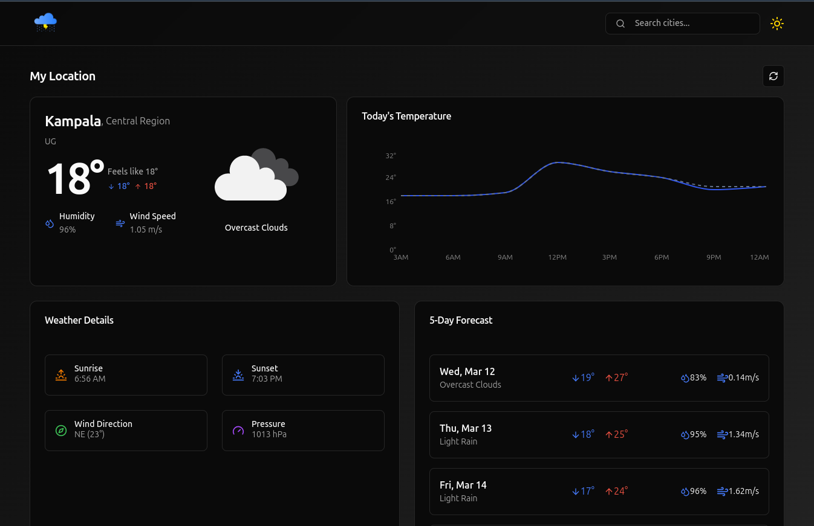

# React Weather App 🔥🔥

This project is a comprehensive weather application built using modern web technologies.

## Building Features

- **React**
- **Tanstack Query**
- **Shadcn UI**
- **Recharts**
- **Tailwind CSS**
- **TypeScript**

## Installation

To get started with this project, clone the repository and install the dependencies:

```sh
git clone https://github.com/your-username/react-weather-app.git
cd react-weather-app
npm install
```
## Environment Variables
Create a .env file in the root directory of the project and add the following variables:
```
VITE_OPENWEATHER_API_KEY=your_openweather_api_key
```
## Usage
To run the project locally, use the following command:
```
npm run dev
```
This will start the development server and you can view the app at http://localhost:5173.

To build the project for production, use the following command:
```
npm run build
```

## License
This project is licensed under the MIT License.

## Screenshot
